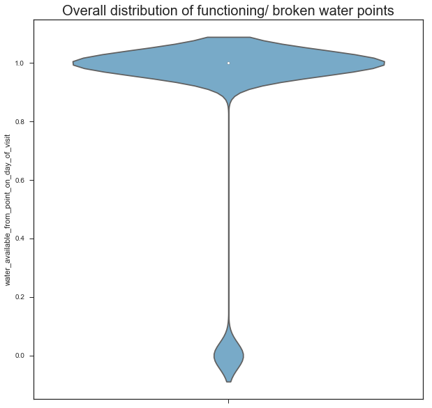
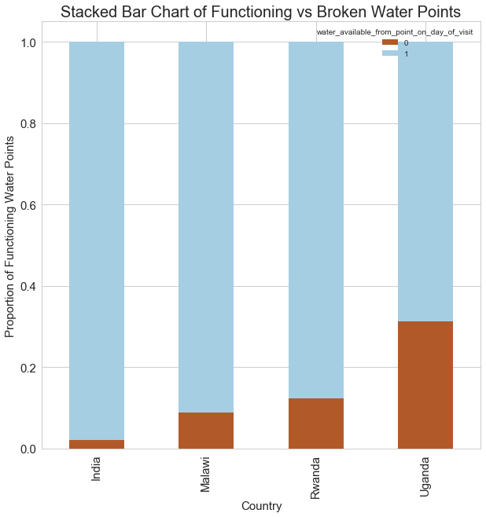
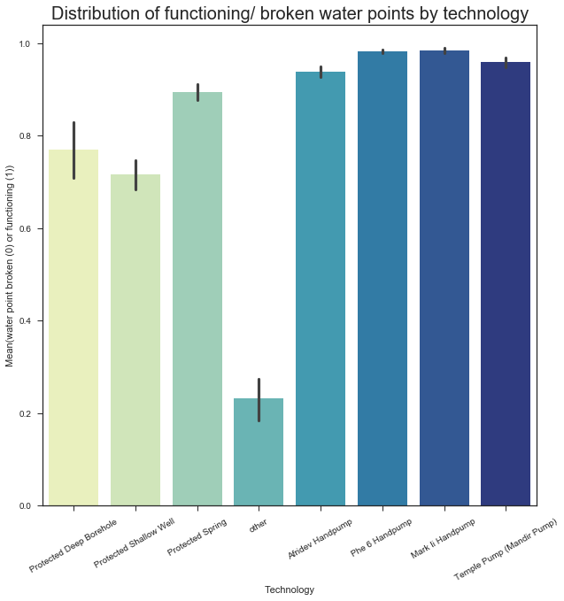
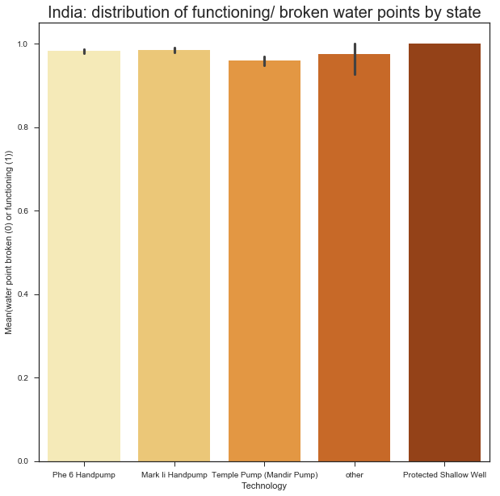
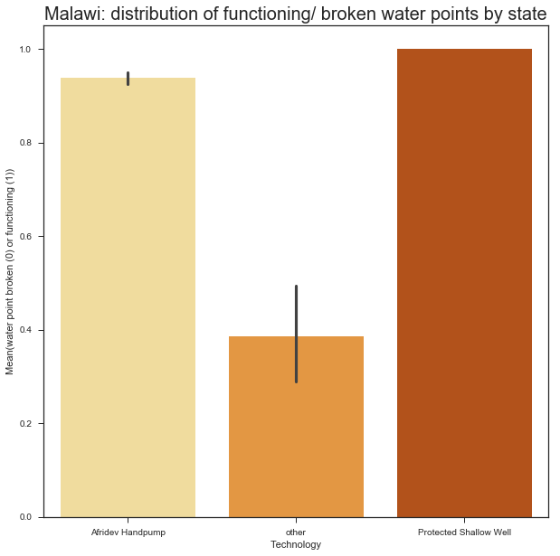
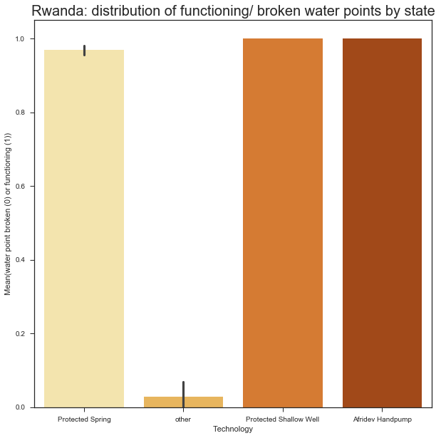
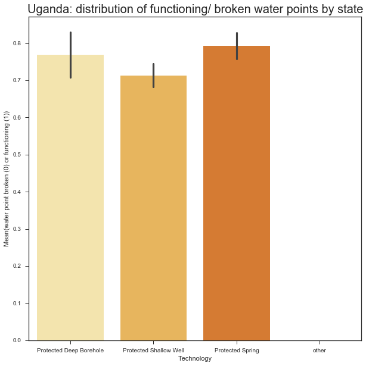
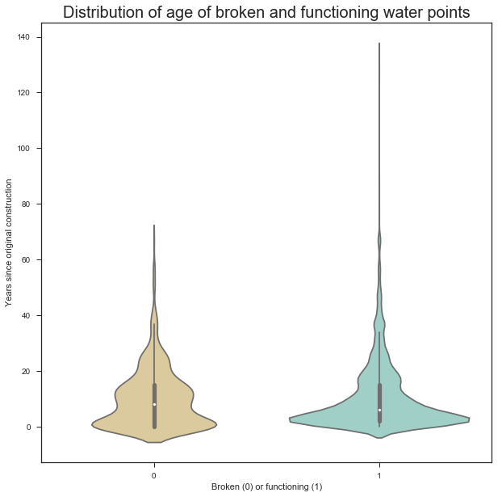
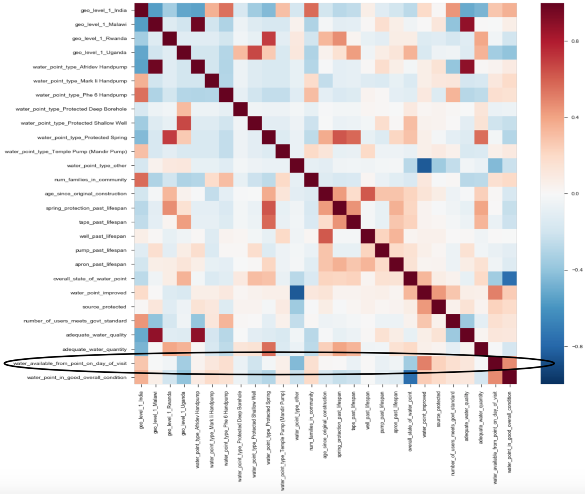
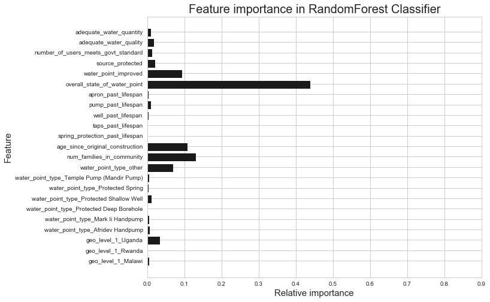

# **Is there Water?**

A Denver non-profit works with district-level governments around the world to assess communities without adequate access to clean water, identify appropriate technologies, and design and construct water points for underserved populations. In 2017, the organization conducted a full census of water points in supported districts of four countries. The census survey included information on location of each water point, the size of the population it serves, physical condition of the hardware, and whether or not the water point was functioning – among other information. The resulting dataset is intended as a tool for local governments in their planning and budgeting for clean water coverage within their jurisdictions.

The organization hopes to use the water point census dataset to better understand the factors that contribute to the likelihood of a waterpoint breaking. In their annual planning, they want to be able to guide local partners on which water points to inspect and earmark funds to support maintenance. This could greatly improve maintenance response times and, ideally, help local governments in their planning to ensure total coverage of clean water access for their constituents.

### The analytics questions:
* What are the key predictors of whether or not a water point is functioning on any given day?
* Is the organization able to identify with reasonable certainty which water points are likely to need maintenance or replacement?

### The dataset:
The water point census data was collected through mobile phone surveys by local engineers who are trained to assess the components of the water point technologies. There is one survey for handpumps and spring-fed taps and another for piped water systems, and the completed surveys are submitted to a cloud aggregator that then exports a CSV file. This analysis will focus on data from handpumps and spring-fed taps. Piped water systems are heavily monitored and managed, and when one is broken it does not go unnoticed. Handpumps, in contrast, in very remote areas can become defunct without governments taking much notice.

## **Exploratory data analysis (EDA)**
The CSV dataset has 10,034 rows and 52 columns. Two columns have significant missing values and will be removed from the analysis. The feature to be predicted – is the water point functioning or not? – is imbalanced, and train-test splits were made with stratification to maintain the proportionality of the original datset. After data cleaning, the resulting dataframe has 10,031 rows and 16 columns. Dummy columns (one-hot) were then created for two categorical features, resulting in a dataframe with 24 columns for use in the analysis.

   

When the data is broken out by country, it becomes evident that the distribution of broken water points varies significantly by country:
* India - About 2% of water points (129/5,991) broken
* Malawi - About 9% of water points (153/1730) broken
* Rwanda - About 12% of water points (91/743) broken
* Uganda - About 31% of water points (489/1,567) broken

This suggests that country could be a significant predictor of broken water points. India accounts for about 60% of the water points in the dataset, and it also has the lowest incidence of broken water points. Therefore, 'India' is assigned as the baseline "dummy" variable in a one-hot encoded (for categorical features) dataframe to be fed into the models.

### Water points broken by type of technology (mean of values 1 or 0) - overall and by country

  

The most common technology in the dataset is the "Phe 6 Handpump," and the technology is also more or less tied for having the lowest proportion of being broken. Therefore, it is assigned as the baseline "dummy" variable in a one-hot encoded (for categorical features) dataframe to be fed into the models.

  

  

There's notable variation by type, but less so in India. The technologies with the highest rate of being broken fall into the "other" category, which are a number of different technologies, each occuring less than 150 times in the dataset. There is enough variation among the 7 main technology types to suggest it could be a useful predictor.

### Age since original construction plotted against whether the water point is broken or functioning

 

Original construction does not seem to have obvious influence on whether or not the water point is functioning or not

### Correlation heatmap - categorical features (country and technology type) dummied:

 

Some of the stronger correlations with whether or not the water point is functioning:
* Whether or not it's in India                              
* If it is a handpump                                       
* Number of households in the community                      
* If it is "improved" and the water source is protected
* Deemed to have adequate water quality
* Engineer has deemed it in "good overall health"

### Pair plots:
Plots and interpretation...

### t-SNE plot:
Plot and interpretation...

## Model fitting:
MVP: Identify coefficients using logistic regression and feature importances using random forests. Tune to optimal hyperparameters. Make a recommendation based on the insights and suggestions for future work.

### Train, test, and holdout datasets:
A holdout dataset (for final model testing) was split off from the full, cleaned dummied dataframe with 2,007 rows. After the holdout set was removed, a dataset with 6,419 rows was split off for training the models, and the remaining rows were split into a test set (80-20 split).

### Random Forest Classifier:

The training dataset was fit to a random forest classifier model - a supervised ensemble machine learning method - to determine the most important features for predicting the target: water points working or not. Resulting feature importances plotted:

  
**5 features account for 5% or more of the variance, with one feature accounting for over 40%**

The model was run with various n_estimators to identify the best precision score - false negative (the model predicts a water point isn't working when it actually is) is preferred to false positive (a broken water point could then get overlooked):
* Precision with 100 estimators: 0.987
* Precision with 50 estimators: 0.987
* Precision with 25 estimators: 0.987
* Precision with 10 estimators: 0.987

**Confusion matrix for model with n_estimators=10:** 
True negative | False positive 
--------------|--------------- 
&nbsp;&nbsp;&nbsp;&nbsp;&nbsp;&nbsp;&nbsp;&nbsp;&nbsp;0.07&nbsp;&nbsp;&nbsp;&nbsp;&nbsp;&nbsp;&nbsp;|&nbsp;&nbsp;&nbsp;&nbsp;&nbsp;&nbsp;&nbsp;&nbsp;&nbsp;&nbsp;&nbsp;&nbsp;0 
--------------|--------------- 
False negative| True positive 
--------------|--------------- 
&nbsp;&nbsp;&nbsp;&nbsp;&nbsp;&nbsp;&nbsp;&nbsp;&nbsp;0.01&nbsp;&nbsp;&nbsp;&nbsp;&nbsp;&nbsp;&nbsp;&nbsp;|&nbsp;&nbsp;&nbsp;&nbsp;&nbsp;&nbsp;&nbsp;&nbsp;&nbsp;&nbsp;&nbsp;&nbsp;0.9 
--------------|--------------- 

**TOO GOOD!**

The feature that was identified as accounting for more than 40% of variance in the data (overall_state_of_water-point) was causing data leakage. The feature labels are scores from 1-3, with the worst score (1) equating to "does not function" - essentially the same as the target feature. The model was run again with that feature removed.

**Revised feature importances:**

  
**Confusion matrix for model with n_estimators=10 and 'overall_state_of_water-point' removed:** 

**Revised precision score:** 
* Recall with 100 estimators: 0.947 
* Recall with 50 estimators: 0.947 
* Recall with 25 estimators: 0.948 
* Recall with 10 estimators: 0.953 
* Recall with 5 estimators: 0.95 
* Recall with 2 estimators: 0.96 
* Recall with 1 estimator: 0.953 

**Confusion matrix for revised model with n_estimators=10:** 
True negative | False positive 
--------------|--------------- 
&nbsp;&nbsp;&nbsp;&nbsp;&nbsp;&nbsp;&nbsp;&nbsp;&nbsp;0.04&nbsp;&nbsp;&nbsp;&nbsp;&nbsp;&nbsp;&nbsp;|&nbsp;&nbsp;&nbsp;&nbsp;&nbsp;&nbsp;&nbsp;&nbsp;&nbsp;&nbsp;&nbsp;&nbsp;0 
--------------|--------------- 
False negative| True positive 
--------------|--------------- 
&nbsp;&nbsp;&nbsp;&nbsp;&nbsp;&nbsp;&nbsp;&nbsp;&nbsp;0.03&nbsp;&nbsp;&nbsp;&nbsp;&nbsp;&nbsp;&nbsp;&nbsp;|&nbsp;&nbsp;&nbsp;&nbsp;&nbsp;&nbsp;&nbsp;&nbsp;&nbsp;&nbsp;&nbsp;&nbsp;0.89 
--------------|--------------- 

## Logistic Regression:
Some lead up...

Some interpretations...

## **Some reflection:**
* Recommend revising the survey after thorough consultation with stakeholders of the dataset to better identify expectations from the analysis.
* Collect data related to governance, funding, and maintainence for water points so that the models can analyze the contributions of those dynamics on the likelihood of functioning/ breaking
* More...

# Study ongoing...
