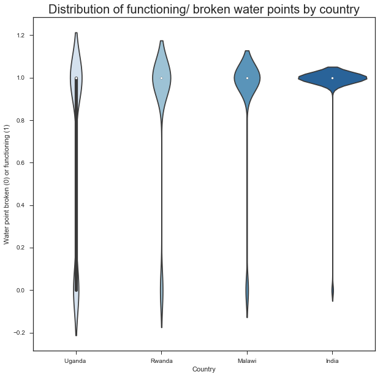
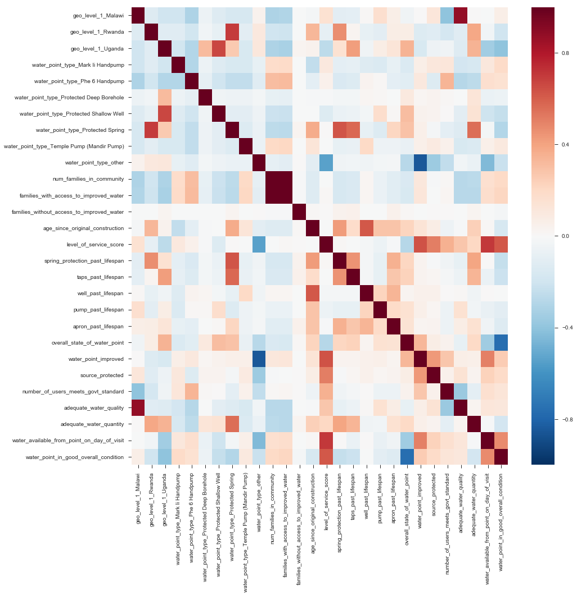

# **Is there Water?**

A Denver non-profit works with district-level governments around the world to assess communities without adequate access to clean water, identify appropriate technologies, and design and construct water points for underserved populations. In 2017, the organization conducted a full census of water points in supported districts of four countries. The census survey included information on location of each water point, the size of the population it serves, physical condition of the hardware, and whether or not the water point was functioning – among other information. The resulting dataset is intended as a tool for local governments in their planning and budgeting for clean water coverage within their jurisdictions.

The organization hopes to use the water point census dataset to better understand the factors that contribute to the likelihood of a waterpoint breaking. In their annual planning, they want to be able to guide local partners on which water points to inspect and earmark funds to support maintenance. This could greatly improve maintenance response times and, ideally, help local governments in their planning to ensure total coverage of clean water access for their constituents.

### The analytics questions:
* What are the key predictors of whether or not a water point is functioning on any given day?
* Is the organization able to identify with reasonable certainty which water points are likely to need maintenance or replacement?

### The dataset:
The water point census data was collected through mobile phone surveys by local engineers who are trained to assess the components of the water point technologies. There is one survey for handpumps and spring-fed taps and another for piped water systems, and the completed surveys are submitted to a cloud aggregator that then exports a CSV file. This analysis will focus on data from handpumps and spring-fed taps. Piped water systems are heavily monitored and managed, and when one is broken it does not go unnoticed. Handpumps, in contrast, in very remote areas can become defunct without governments taking much notice.

## **Targeted EDA**
The CSV dataset has 10,034 rows and 52 columns. Most columns have no more than 3 missing values. Two columns have significant missing values and will be removed from the analysis. The feature to be predicted – is the water point functioning or not – has 863 entries for ‘not functioning’ (0), and 9,171 entries for ‘functioning’ (1).

   

When the data is broken out by country, it becomes evident that the distribution of broken water points varies significantly by country:
* India - About 2% of water points (129/5,991) broken
* Malawi - About 9% of water points (153/1730) broken
* Rwanda - About 12% of water points (91/743) broken
* Uganda - About 31% of water points (489/1,567) broken

This suggests that country could be a significant predictor of broken water points, though it's important to not that India accounts for about half of water points in the dataset, and the smaller number of data points for each of the other three countries might compromise statistical significance.

### Water points broken by type of technology (mean of values 1 or 0) - overall and by country

  

  

  

There's notable variation by type, but less so in India. The technologies with the highest rate of being broken fall into the "other" category, which are a number of different technologies, each occuring less than 150 times in the dataset. There is enough variation among the 7 main technology types to suggest it could be a useful predictor.

### Age since original construction plotted against whether the water point is broken or functioning

 

Original construction does not seem to have obvious influence on whether or not the water point is functioning or not

### Correlation heatmap - categorical features (country and technology type) dummied:
div>

 

* **Pair plots**
* **t-SNE plot**

The data are not normally distributed, but **there appears to be a linear relationship with each**. Data points, however, are clustered at the low end on both axis.
To investigate further, the feature data were split into two categories - **least developed** and **most developed countries** - using the median value for each feature:

   

## Minimum viable product:
Identify coefficients using logistic regression and feature importances using random forests. Tune to optimal hyperparameters. Make a recommendation based on the insights and suggestions for future work.

## MVP +:
Apply a Naïve Bayes model to the dataset to see how it might be able to predict whether water points are broken or not.

## **Logistic Regression**
Some lead up...

## **Some reflection:**
* Recommend revising the survey after thorough consultation with stakeholders of the dataset to better identify expectations from the analysis.
* More...

# Study ongoing...
