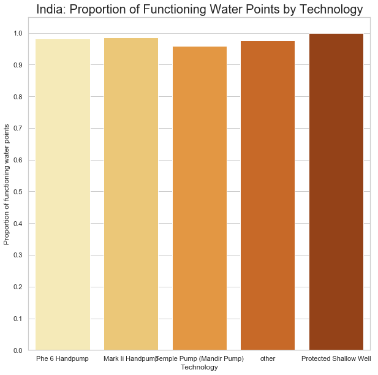

# **Is there Water?**

A Denver non-profit works with district-level governments around the world to assess communities without adequate access to clean water, identify appropriate technologies, and design and construct water points for underserved populations. In 2017, the organization conducted a full census of water points in supported districts of four countries. The census survey included information on location of each water point, the size of the population it serves, physical condition of the hardware, and whether or not the water point was functioning – among other information. The resulting dataset is intended as a tool for local governments in their planning and budgeting for clean water coverage within their jurisdictions.

The organization hopes to use the water point census dataset to better understand the factors that contribute to the likelihood of a waterpoint breaking. In their annual planning, they want to be able to guide local partners on which water points to inspect and earmark funds to support maintenance. This could greatly improve maintenance response times and, ideally, help local governments in their planning to ensure total coverage of clean water access for their constituents.

### The analytics questions:
* What are the key predictors of whether or not a water point is functioning on any given day?
* Is the organization able to identify with reasonable certainty which water points are likely to need maintenance or replacement?

### The dataset:
The water point census data was collected through mobile phone surveys by local engineers who are trained to assess the components of the water point technologies. There is one survey for handpumps and spring-fed taps and another for piped water systems, and the completed surveys are submitted to a cloud aggregator that then exports a CSV file. This analysis will focus on data from handpumps and spring-fed taps. Piped water systems are heavily monitored and managed, and when one is broken it does not go unnoticed. Handpumps, in contrast, in very remote areas can become defunct without governments taking much notice.

## **Exploratory data analysis (EDA)**
The CSV dataset has 10,034 rows and 52 columns. Two columns have significant missing values and will be removed from the analysis. The feature to be predicted – is the water point functioning or not? – is imbalanced, and train-test splits were made with stratification to maintain the proportionality of the original datset. After data cleaning, the resulting dataframe has 10,031 rows and 16 columns. Dummy columns (one-hot) were then created for two categorical features, resulting in a dataframe with 24 columns for use in the analysis.

   

**The target has imbalanced classes.** When the data is broken out by country, it becomes evident that the distribution of broken water points varies significantly between them:
* India - About 2% of water points (129/5,991) broken
* Malawi - About 9% of water points (153/1730) broken
* Rwanda - About 12% of water points (91/743) broken
* Uganda - About 31% of water points (489/1,567) broken

India accounts for about 60% of the water points in the dataset, and it also has the lowest incidence of broken water points. Therefore, **'India' is assigned as the baseline** "dummy" variable in a one-hot encoded (for categorical features) dataframe to be fed into the models.

### Proportion of water points by type of technology - overall and by country:

  

The most common technology in the dataset is the "Phe 6 Handpump," and the technology is also more or less tied for having the lowest proportion of being broken. Therefore, the **Phe 6 Handpump is assigned as the baseline** "dummy" variable in a one-hot encoded (for categorical features) dataframe to be fed into the models.
  
  

  

  

There's notable variation by type at the country level, but less so in India. The technologies with the highest rate of being broken fall into the "other" category, which are a number of different technologies, each occuring less than 150 times in the dataset. There is enough variation among the 7 main technology types to suggest it could be a useful predictor.

### Age since original construction plotted against whether the water point is broken or functioning

 

The oldest water points in the dataset are functioning, and broken water points are by and large newer - the opposite of what would be expected. There is a high proportion of functioning water points that are newer.

### Correlation heatmap - categorical features (country and technology type) dummied:

 

**Some of the stronger correlations with the target - whether or not the water point is functioning:**
* Whether or not it's in India (positive) or in Uganda (negative)                           
* If it is a handpump (positive)
* If it is one of the less common technologies (negative)
* Number of households in the community (positive)
* If it is "improved" and the water source is protected (positive)
* Deemed to have adequate water quality (positive)

**Malawi, water quality, and Afridev Handpump:**
* The model of pump only occurs in Malawi (accpet 1), and would only be relevant in a Malawi-specific analysis
* 85% of all "adequate water quality" responses were in Malawi. 96% of all "adequate water quality" responses were for the Afridev Handpump. **Suspicious!** Potentially a result of dishonest reporting by a local partner associated with that technology.
* **adequate_water_quality** and **water_point_type_Afridev Handpump** were removed from the dataset for analysis.

**Other interesting correlations for further analysis - not related to predicting the target:**
* Age of the water point (since original construction) and various components being past their factory prescribed lifespan. Is age a good predictor of whether a pump is functioning afterall?
* Water type: "protected spring" and components being past their factory prescribed lifespan. Perhaps this water point type should be prioritized for updating.
* The category of water point types "other" (those that only occur a few times in the dataset) have a strong negative correlated with functioning. Could be investigated whether those types should continue to be supported.

### Pair plots with continuous features and the target:

 

Plotting the target against the continuous variable "num_families_in_community," there seems to be a higher proportion of functioning water points in communities with higher populations, and a higher proportion of broken water points in lower population communities. This, perhaps, could be an issue of prirotiy and funding allocated for maintainance. Similarly, older water points have a higher proportion of functioning water points, which again could point to those water points being more consistently managed.

On the other hand, this distribution **could just be an effect of the imbalanced class** - "functioning" occurs far more often.

## Model fitting:
Identify feature importances using and (partial dependence of most important features) using random forests and coefficients using logistic regression. Tune to optimal models. Make recommendations based on the insights and suggestions for future work.

### Train, test, and holdout datasets:
A holdout dataset (for final model testing) was split off from the full (stratified), cleaned dummied dataframe with 2,007 rows. After the holdout set was removed, a dataset with 6,419 rows was split off for training the models, and the remaining rows were split into a test set (80-20 split). The training and test sets were used to fit and score the models, applying K-fold crossvalidation (n_splits=4).

### Random Forest Classifier:

The random forest classifier is a supervised ensemble machine learning model...

The training dataset was fit to a random forest model to determine the most important features for predicting the target: water points working or not. **The model was run with various n_estimators to identify the best precision score (tp / (tp + fp))** - false negative (the model predicts a water point isn't working when it actually is) is preferred to false positive (a broken water point could then get overlooked). Set the hyperparameter **class_weight='balanced'** to help deal with the imbalanced class:
* Precision with 1000 estimators: 0.981
* Precision with 100 estimators: 0.981
* Precision with 50 estimators: 0.981
* Precision with 25 estimators: 0.981
* Precision with 10 estimators: 0.981

**Precision is TOO GOOD and very consistent!**

One feature (overall_state_of_water-point) was causing data leakage. The feature labels are scores from 1-3, with the worst score (1) equating to "does not function" - essentially the same as the target feature. The model was run again with that feature removed, with the following results:
* Precision with 1000 estimators: 0.95
* Precision with 100 estimators: 0.949
* Precision with 50 estimators: 0.949
* Precision with 25 estimators: 0.949
* Precision with 10 estimators: 0.95

**Still TOO GOOD!** The model is guessing 1 (water point functioning) nearly always.

To further address the imbalanced classes, the **S**ynthetic **M**inority **O**versampling **TE**chnique **(SMOTE)** method was applied **(k_neighbors=4)** to create new instances of the minority class (in this case 0 for broken) between actual instances, evening out the distirubtion of 1s and 0s in the target data. An example (credit: http://rikunert.com) with a continuous y feature:

**Results with SMOTE:**
* Precision with 1000 estimators: 0.71
* Precision with 100 estimators: 0.71
* Precision with 50 estimators: 0.711
* Precision with 25 estimators: 0.709
* Precision with 10 estimators: 0.709

**More reasonable results, with some variation.** The best precision score was 0.711, and the model is therefore set to **50 estimators**. The next step is to calculate the most important features for predicting the target. The feature importances are measured using the total information gain increases from splits on each given feature in the "forest." Steps:
* For each feature, the decrease in impurity criterion (**criterion='gini'**) is calculated for nodes that split on it, weighted by how many data points pass through those nodes.
* Average that calculation for each node across the "forest."

**4 features account for 10%-20% of the variance in the data each:**
* Being in Uganda
* Household population in cthe community
* Age of the water point (since original consturction)
* Being an "other" water point type

**5 features account for less than 1% of the variance**, and the tuned model and was run again with those features removed, and the feature importances were recalculated:
* **Precision: 0.708** 

 
Neither the precision score or feature importances showed significant change with the low importance features taken out (the most important feature became slightly less important), so the model was run with the holdout set.
  
**Precision score and confusion matrix with holdout data:** 
* Precision: **0.94** 
  
True negative | False positive 
--------------|--------------- 
&nbsp;&nbsp;&nbsp;&nbsp;&nbsp;&nbsp;&nbsp;&nbsp;&nbsp;&nbsp;&nbsp;&nbsp;68&nbsp;&nbsp;&nbsp;&nbsp;&nbsp;&nbsp;&nbsp;|&nbsp;&nbsp;&nbsp;&nbsp;&nbsp;&nbsp;&nbsp;&nbsp;&nbsp;&nbsp;&nbsp;&nbsp;104 
--------------|--------------- 
False negative| True positive 
--------------|--------------- 
&nbsp;&nbsp;&nbsp;&nbsp;&nbsp;&nbsp;&nbsp;&nbsp;&nbsp;&nbsp;&nbsp;66&nbsp;&nbsp;&nbsp;&nbsp;&nbsp;&nbsp;&nbsp;&nbsp;|&nbsp;&nbsp;&nbsp;&nbsp;&nbsp;&nbsp;&nbsp;&nbsp;&nbsp;&nbsp;&nbsp;&nbsp;1769 
--------------|--------------- 
  
  

## Logistic Regression:

 

### Study ongoing...

  
  

## **Some reflection:**
* Recommend revising the survey after thorough consultation with stakeholders of the dataset to better identify expectations from the analysis.
* Collect data related to governance, funding, and maintainence for water points so that the models can analyze the contributions of those dynamics on the likelihood of functioning/ breaking
* Run the models on country disaggregated datasets

### Study ongoing...
